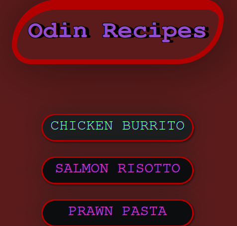

# odin-recipes

Available at: https://charbytesdev.github.io/odin-recipes/

A recipe website created using HTML and CSS

HTML project: Recipe website
HTML Skills demonstrated: Create a boilerplate creation, use headers, work with text, lists, links, images and file structuring
Git Skills demonstrated: basic git usage, commit message structure

Update: Added eye-catching styles using CSS for an enhanced user experience

## Odin - Recipes

Odin Recipes is a website that stores various recipes made with CSS and HTML.

## Deployment

Available at: https://charbytesdev.github.io/odin-recipes/

## Features

- [x] Home page
- [x] 3 recipe pages with corresponding recipe

 

## Built With

- [HTML](https://developer.mozilla.org/en-US/docs/Web/HTML) - Hyper Text Markup Language
- [CSS](https://developer.mozilla.org/en-US/docs/Web/CSS) - Cascading Style Sheets
